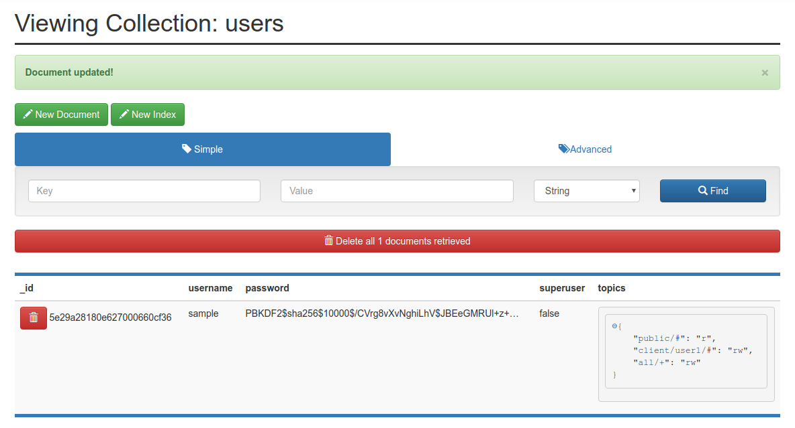

# docker-mosquitto-auth-plugin

[](https://travis-ci.org/mistadave/docker-mosquitto-auth-plugin)

This repository contains a Docker file, which creates a mqtt container with the mqtt-auth-plug with a MongoDB server configuration.
Also is the mongo-express for a simple web-view of the mongodb added to the compose file.

View the mongo db on [http://localhost:8081](http://localhost:8081).

Connect to the mqtt via: **localhost:1883**. A nice tool for mqtt connection testing is: [MQTTfx](http://mqttfx.org).

## Run directly

Run directly with already build image.

```bash
docker run -p 1883:1883 -v ./mosquitto.conf:/mosquitto/conf/mosquitto.conf chirage/mosquittoauthpluginmongo:latest
```

## Build

The simplest way to build the mqtt container with the auth plugin is to run the *run-compose.sh* script.

```bash
./run-compose.sh
```

Now you're able to connect to the mqtt with the user: **user1** and password **hallo** on localhost with port 1883.

It creates the mqGate db with the init script and also the given sample user with password to test the authentication with mongodb.

To clear all data and shutdown the service run the *clear-compose.sh* script.

### Manual

Or build the container manual.

```bash
docker build --rm -f "Dockerfile" -t mosquittoauthplugin:latest "."

# run it
docker run -it \
-v ./mosquitto.conf:/mosquitto/conf/mosquitto.conf \
--name mqtt-auth \
-p 1883:1883 \
mosquittoauthplugin:latest
```

## MongoDB configuration

The current configuration uses the root user for mongodb, which should only be used for development purposes.

Now you need to create the Collections for the mqtt to use it. [Main Git Repo link](https://github.com/jpmens/mosquitto-auth-plug#mongodb-auth)

### Create only users collection

You create only one collection with the user, password and the allowed topics.
You need following columns:

* username (String)
* password (String)
* supperuser (Boolean)
* topics (Object)

This is gonna look like on the picture.


To generate the password the **contrib** folder on the Main Github repo will help you. You'll find there several implementation samples in different languages.

[Link to main repo](https://github.com/jpmens/mosquitto-auth-plug/tree/master/contrib)

Sample hash for password: **hallo**

```
PBKDF2$sha256$10000$9D0XLHLBXowu1s0R$YLm2tf9JJ9jLY1ty2MZRsHNM5j4tNLAo
```

### (Optional) Create users and seperat topics collection

You can also create the users and topics collection seperate. For this you need to add the following prop in the configuration file.

* **user_topiclist_fk_prop topics** -> Property used as a foreign key to reference a topiclist document
* **topiclist_key_prop _id** -> Unique key in the topiclist document pointed to by user_topiclist_fk_prop
* **topiclist_topics_prop topics** -> Property containing topics within the topiclist document

Go see the doc on the main git repo for the exact implementation.

### (Optional) Create new DB user

Create a user for the mqtt plugin on the mqGate Database, since you wan't to use the root user because of security reasons.

Therefore login on the mongo container either with the mongo shell or direct on the docker container, where the mongo shell is also installed.

**Mongo Shell**
To login with the mongo shell, you need to have it installed on your local machine. On the following link, you'll find out how to install it. [Mongo Shell Link](https://docs.mongodb.com/manual/mongo/)

```bash
mongo -u root localhost:27017/admin
```

**Docker Container**
The name "mongo" stands for the container name, which may be different.

```bash
docker exec -it mongo bash

mongo -u root localhost:27017/admin
```

**Mongo Create user**
Now you're on the mongo shell and can use the mongo commands to create a new user for your database.

```bash
show dbs
# this lists all current databases on your mongodb instance.
use mqGate
# use your mqtt db in this case, mqGate.
db.createUser({
    user: "mqtt2",
    pwd: "mqtt",
    roles: [{role: "readWrite", db: "mqGate"}]
})
# this Should return: Successfully added user: ....
```

Now you need to change the uri in the mosquitto.conf file with the new generated user credentials.

[Doc Link](https://docs.mongodb.com/manual/reference/method/db.createUser/)
